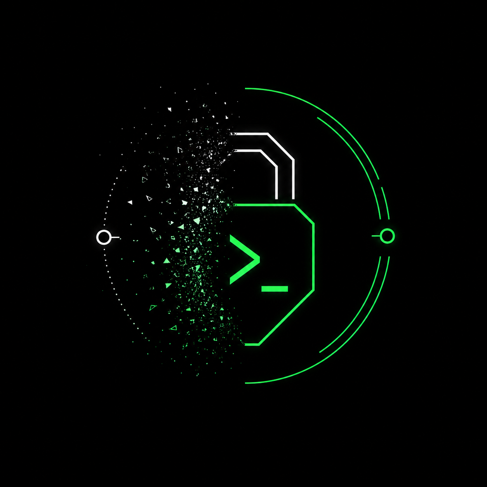

<div align="center">
  

  <h1>road-1337</h1>
  <p><strong>Blind Relay E2EE — Zero Trust Infrastructure</strong></p>
  <p><em>Ephemeral. RAM-only. Unobservable.</em></p>
  
  <a href="https://github.com/ValeryCherneykin/road-1337/releases"></a>
  <a href="https://github.com/ValeryCherneykin/road-1337/blob/main/LICENSE"></a>
</div>

---

## ⚠️ The Honesty Clause: Be a Skeptic

**Do not blindly trust this software.** 
In the realm of privacy, anyone guaranteeing "100% absolute anonymity" is either lying or naive. Security is a continuous process, not a static product. `road-1337` provides a robust, mathematically sound mechanism for end-to-end encryption using state-of-the-art primitives (X25519, ChaCha20-Poly1305), but **operational security (OpSec) is your responsibility**. 

We encourage healthy paranoia:
* Verify your peers' public keys strictly out-of-band (in person, PGP, Signal).
* Rent your VPS anonymously (crypto) if true identity obfuscation is required.
* Review the source code. Trust the math, verify the implementation. 

---

## 🧠 Core Philosophy: Why road-1337?

Most messengers leave forensic traces. `road-1337` is designed around absolute ephemerality:
1. **The Blind Relay:** The server routes packets of exact 4096-byte encrypted noise. It has no keys, cannot decrypt the payload, and does not log connections.
2. **RAM-Only Architecture:** Zero disk I/O. Keys and messages exist strictly in memory.
3. **Provable Memory Zeroization:** The codebase explicitly calls `clear(buf)` on all sensitive byte slices upon transmission, exit, or forced crash. Our test suite includes race-detector-enabled checks validating that memory is overwritten, leaving no residual data for cold-boot or memory-dump attacks.

---

## ⚡ Demo

*Note: The relay routes the connection. The keys stay on the endpoints. Everything happens in RAM.*


---

## 🚀 Installation

We support macOS, Linux, and Windows natively.

### macOS & Linux (Homebrew)
```bash
brew tap ValeryCherneykin/road-1337
brew install road-1337
````

### Windows (Scoop)

PowerShell

```
scoop bucket add road-1337 [https://github.com/ValeryCherneykin/scoop-road-1337.git](https://github.com/ValeryCherneykin/scoop-road-1337.git)
scoop install road-1337/road-1337
```

### Run a Server / Blind Node (Docker)

Deploy a headless relay node in seconds on any VPS. Our image is built from `scratch` (0 bytes OS overhead).

Bash

```
docker run -d --restart unless-stopped -p 1337:1337 ghcr.io/valerycherneykin/road-1337:latest
```

## 📖 Quick Start Guide

**Step 1: Generate your local keychain**

Both peers must generate their keys locally. The private key is encrypted at rest using Argon2id.

Bash

```
road-1337 generate-keychain
```

**Step 2: Share keys securely**

Exchange your generated `Public Key` with your peer via a secure out-of-band channel.

**Step 3: Connect to the Relay**

Once a relay server is running (e.g., via Docker on a VPS at `194.137.0.14`), both peers connect to it using the _other peer's_ public key:

Bash

```
road-1337 194.137.0.14:1337@<PEER_PUBLIC_KEY>
```

## 🔐 Security Architecture

| **Layer**          | **Mechanism**                                       |
| ------------------ | --------------------------------------------------- |
| **Key Exchange**   | X25519 Elliptic-Curve DH                            |
| **Key Derivation** | HKDF-SHA256 (NIST SP 800-56C)                       |
| **Encryption**     | ChaCha20-Poly1305 AEAD                              |
| **Key at rest**    | Argon2id + ChaCha20-Poly1305                        |
| **DPI Resistance** | All packets padded to exactly 4096 B                |
| **Memory Safety**  | Forced `clear()` on key material at every exit path |

### Network Flow

Plaintext

```
┌─────────────────────────────────────────────────────┐
│                   Blind Relay                       │
│  map[SHA256(pubKey)] → net.Conn                     │
│  sync.RWMutex  │  sync.Pool  │  log → /dev/null     │
│  clear(buf) after every Write()  [Burn-on-Read]     │
└───────────────────┬─────────────────────────────────┘
                    │  encrypted noise (4096 B packets)
        ┌───────────┴──────────┐
        │                      │
   ┌────┴────┐            ┌────┴────┐
   │ Client A│            │ Client B│
   │ X25519  │←─ ECDH ──→ │ X25519  │
   │ HKDF    │            │ HKDF    │
   │ ChaCha20│            │ ChaCha20│
   └─────────┘            └─────────┘
     Out-of-band key exchange (no relay involved)
```

## 🛠 Development & Contribution

We demand strict code quality. To contribute, assure all pipelines pass locally.

Bash

```
# Install linter and formatting tools
make install-tools

# Run full checks (format, vet, lint, and test with race detector)
make check
```
